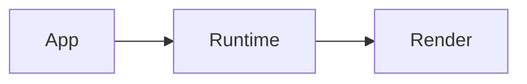

# VISR documentation site

The project documentation is a Docusaurus site contained entirely in this directory.

## Run and build

```sh
cd docs
npm install
npm run start
npm run build
```

The local site runs at `http://localhost:3000`; the production output is written to `docs/build/`.

## Content

- Documentation pages live in `pages/` as Markdown or MDX files.
- Navigation is configured in `sidebars.js`.
- Site configuration is in `docusaurus.config.js`.
- Put images and other static assets in `static/img/` and refer to them as `/img/name.ext`.

## Diagrams

Use Mermaid fenced blocks for flow charts, sequences, and other supported diagrams:

````md

````

Graphviz/DOT is rendered in the browser with the `Graphviz` MDX component. Import it in an MDX page and provide DOT source as a template string:

```mdx
import Graphviz from '@site/src/components/Graphviz';

<Graphviz label="Example data flow">{`digraph Example { App -> Runtime -> Render }`}</Graphviz>
```

Prefer source text over checked-in generated SVGs so diagrams remain reviewable and editable.
